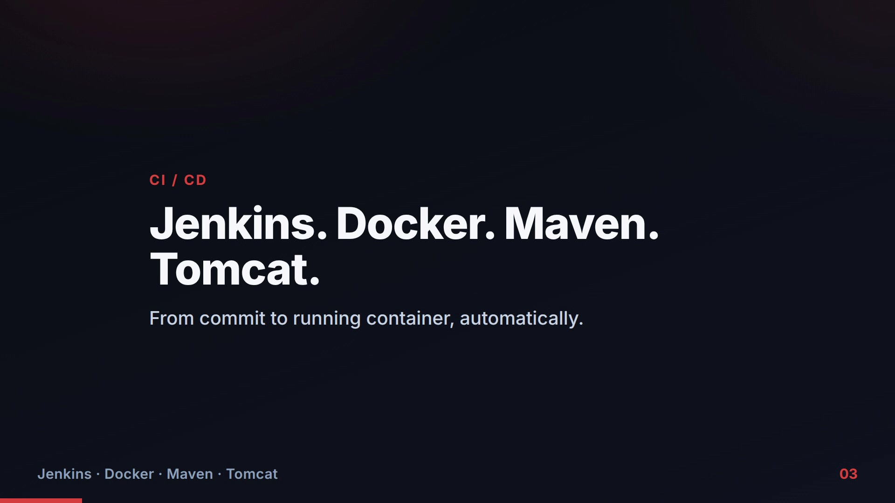
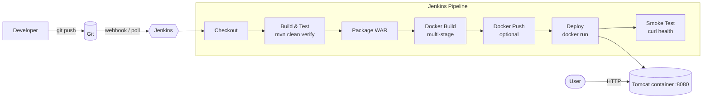

<div align="center">

# Java CI/CD — Jenkins · Docker · Maven · Tomcat

**A complete build-to-deploy pipeline for a Java web app: Maven compiles and tests it, a multi-stage Docker image bakes the WAR into Tomcat, and a Jenkins pipeline drives commit → tested → packaged → deployed → smoke-tested.**

[](https://www.jenkins.io/)
[](https://www.docker.com/)
[](https://maven.apache.org/)
[](https://tomcat.apache.org/)
[](https://openjdk.org/)

<br/>

### 🎬 24-second explainer

[](media/explainer.mp4)

*Click the image to play the video.*

</div>

---

## The Problem

Shipping a Java application by hand — compile, run tests, build a WAR, copy it
onto a server, restart Tomcat — is slow and easy to get wrong. One forgotten
step and production runs stale or broken code.

This project automates the whole path. Every commit is built, tested, packaged,
containerised, deployed, and health-checked the same way, every time — the core
of **continuous integration and continuous delivery**.

## What It Does



A small Java web app (a JSP landing page + a servlet) is the payload; the value
is the **automation around it**.

## Key Engineering Decisions

| Decision | Why it was made |
|----------|-----------------|
| **Multi-stage Docker build** | The build stage (JDK + Maven + dependency cache) is thrown away; the final image ships only Tomcat + the WAR — smaller and far less to attack. |
| **Dependencies cached before sources are copied** | `pom.xml` is copied and dependencies fetched in their own layer, so editing code doesn't re-download the internet on every build. |
| **Tests run before any image is built** | A failing unit test stops the pipeline at `mvn verify`, before packaging or deploy — fail fast, fail cheap. |
| **Deploy is followed by an automated smoke test** | The pipeline `curl`s the app after `docker run`; a container that starts but doesn't serve fails the build instead of silently shipping. |
| **Business logic separated from the servlet** | `GreetingService` is unit-tested with no servlet container; the servlet is a thin HTTP adapter. |
| **WAR deployed as `ROOT.war`** | The app is served at `/`, the correct layout for a single-app container. |
| **Jakarta namespace + Tomcat 10** | Matched deliberately — the classic cause of Tomcat 404/ClassNotFound errors is mixing `javax` with a `jakarta`-era Tomcat. |

## Verified End to End

Both halves of the pipeline were run and confirmed in this project:

**1. Maven build + tests**
```text
$ mvn -B clean verify
BUILD SUCCESS   →  target/java-tomcat-app.war   (4 unit tests passed)
```

**2. The WAR running in the Tomcat container**
```text
$ curl "http://localhost:8080/hello?name=Recruiter"
Hello, Recruiter!
Served by container 29bed30ed284
Built with Maven, packaged as a WAR, deployed on Tomcat via Jenkins + Docker.
```

CI (`.github/workflows/ci.yml`) re-runs the Maven build, the tests, and the
**multi-stage Docker build** on every push.

## Technology Stack

| Area | Technologies |
|------|--------------|
| Build & test | Java 21, Maven, JUnit 5 |
| Packaging & runtime | WAR, Docker (multi-stage), Apache Tomcat 10 |
| CI/CD | Jenkins (declarative `Jenkinsfile`), GitHub Actions |
| App | Jakarta Servlet, JSP |

## Repository Structure

```text
.
├── pom.xml                 # Maven build (WAR), dependencies, plugins
├── src/
│   ├── main/java/...       # GreetingService + HelloServlet
│   ├── main/webapp/        # index.jsp
│   └── test/java/...       # JUnit 5 tests
├── Dockerfile              # multi-stage: Maven build -> Tomcat runtime
├── docker-compose.yml      # one-command local run
├── Jenkinsfile             # declarative CI/CD pipeline
├── .github/workflows/      # GitHub Actions: build + test + image
├── architecture/           # pipeline diagram
└── docs/                   # implementation notes, Jenkins setup, troubleshooting
```

## Getting Started

**Run locally with Docker (no Jenkins needed):**
```bash
git clone https://github.com/deba310984/jenkins-docker-maven-tomcat
cd jenkins-docker-maven-tomcat
docker compose up --build
# open http://localhost:8080  and  http://localhost:8080/hello?name=You
```

**Build and test without Docker:**
```bash
mvn clean verify          # produces target/java-tomcat-app.war
```

**Run the full pipeline:** import the repo into Jenkins as a Pipeline job using
the `Jenkinsfile` — step-by-step in [docs/jenkins-setup.md](docs/jenkins-setup.md).

## What This Demonstrates

- Building a real **CI/CD pipeline** from source to a running, health-checked service.
- **Jenkins** declarative pipelines — stages, tools, credentials, artifacts, JUnit reporting.
- **Docker** best practices — multi-stage builds, layer caching, small runtime images, health checks.
- **Maven** build lifecycle, dependency scopes, and automated testing.
- **Deployment automation** with a post-deploy smoke test, plus a clear troubleshooting runbook.
